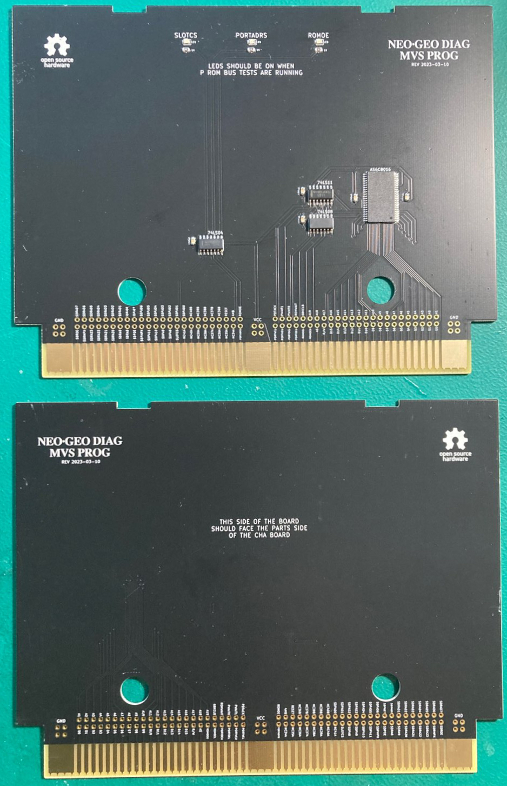
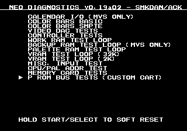
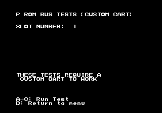
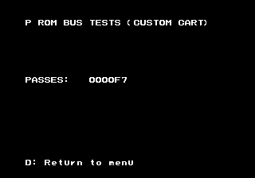

# neogeo-diag-mvs-prog


## Overview
This is a custom NeoGeo MVS Prog board that is used in conjunction with the [NeoGeo Diag Bios](https://github.com/jwestfall69/neogeo-diag-bios) that allows for testing the P ROM address and data buses between the motherboard and the cart slot.  Its meant to help trouble shoot getting a crosshatch screen or if your game cart boots then crashes after a while (possible faulty P ROM bank switching).

It works by using an SRAM chip instead of a ROM for the program rom on the PROG board.  Doing this allows the diag bios to run tests on it similar to that of work ram to find issues.

Its not possible to test all lines related to the program rom, so there are 3 leds at the top of the board.  These 3 LEDs (ROMOE, PORTADDR, SLOTCS) should be lit up when the P ROM Bus tests are running in the diag bios.

<br>

## PCB Manufacturing
PCB should be 1.6mm thickness.  With these boards likely being inserted and removed numerous times its suggested you use ENIG surface finishing and gold fingers w/45 degree chamfering.

I've been using [jlcpcb](https://jlcpcb.com/) for PCB manufacturing.  Just watch out that by default they will add an order number to the silk screen unless you tell them not to.

## BOM
| Quantity | Description | Part Number | Digikey | Notes |
|:--------:|:------------|-------------|---------|-------|
| 1        | SRAM 8Mbit 44 pin TSOP II | AS6C8016-55ZIN | [1450-1041-ND](https://www.digikey.com/en/products/detail/alliance-memory-inc/AS6C8016-55ZIN/4234600) | |
| 1        | 74LS04 pin 14 SOIC | SN74LS04DR | [296-14875-2-ND](https://www.digikey.com/en/products/detail/texas-instruments/SN74LS04DR/562927) | |
| 1        | 74LS08 pin 14 SOIC | SN74LS08DR | [296-14879-2-ND](https://www.digikey.com/en/products/detail/texas-instruments/SN74LS08DR/562906) | |
| 1        | 74LS11 pin 14 SOIC | SN74LS11DR | [296-28984-2-ND](https://www.digikey.com/en/products/detail/texas-instruments/SN74LS11DR/1571760) | |
| 5        | 100nf / 0.1uf Ceramic Capacitor 0805 Size | CL21B104KBCNNNC | [1276-1003-2-ND](https://www.digikey.com/en/products/detail/samsung-electro-mechanics/CL21B104KBCNNNC/3886661) | Any 100nf 0805 is fine |
| 3        | 1K Ohm resistor 0805 Size | ERJ-6GEYJ102V | [P1.0KACT-ND](https://www.digikey.com/en/products/detail/panasonic-electronic-components/ERJ-6GEYJ102V/83014) | Any 1K 0805 resistor is fine |
| 3        | Green LED 0805 12mcd | LTST-C171GKT | [160-1423-2-ND](https://www.digikey.com/en/products/detail/liteon/LTST-C171GKT/386793) | Other 0805 size LEDs should be fine |

## Assembly
The SRAM has a really fine pin pitch, so take your time.  Other then that nothing special.

## Usage
The prog board should be used along with a valid CHA board.  Ideally you probably want a full diag cart where the CHA board has the M1 diag rom and this PROG board.  The cart should be inserted into the slot and then boot the board with the diag bios. Goto the main menu screen.



Pick: ```P ROM BUS TESTS (CUSTOM CART)```



If you have a multi-slot board you can use the left/right on the joystick to change the slot number the test will run on.  Then press A+C to start the tests or D to go back to the main menu.

In the event you pick the wrong/empty slot and you get a white screen you can press D to stop the test.  This should also fix your screen as it will switch back to the onboard sfix rom for text.



The tests will run continually until D is pressed or an issue is detected.  While the tests are running you should expect the 3 LEDs on the PROG board to be lit up.

If you attempt to run the P rom bus tests without the diag PROG board you will get a ```P2 UNWRITABLE (LOWER)``` error.
